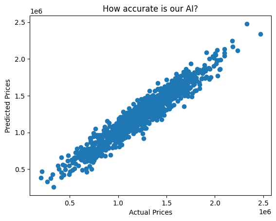

🏠 Predictive Analyst: House Price Prediction (ML)
A Machine Learning model using Linear Regression to predict housing prices based on features like square footage and number of rooms.

 🎯 Project Goal
To build a Machine Learning model that accurately predicts house prices based on factors like area income, house age, and number of rooms.

 🤖 The Model
I utilized a **Linear Regression** algorithm, which is a fundamental supervised learning technique. The model was trained on a dataset of 5,000 housing records, using an 80/20 split for training and testing.

 📈 Model Performance

As shown in the scatter plot, the predicted prices align closely with the actual prices, forming a strong diagonal line. This indicates a high level of accuracy and a low error rate.

 🛠️ Tools Used
* Python (Scikit-Learn): For building and training the Machine Learning model.
* Pandas: For data manipulation and feature selection.
* Matplotlib: To visualize the model's predictive power.

 💡 Key Takeaway
This project demonstrates how AI can be used to automate valuation processes in the real estate industry, providing instant estimates with high reliability.
